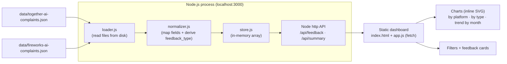

# Developer Feedback Dashboard — Architecture (Local MVP)

Status: **Implemented** · Scope: **Local MVP, no external network calls**
Owner: Squad Architect · Last updated: 2026-06-24

A local dashboard that visualizes public developer feedback about **Together AI** and
**Fireworks AI**. The MVP reads only the two pre-collected JSON files in `data/`,
normalizes them into a canonical schema, and serves them through a small REST API to a
zero-build static frontend. The server has **zero runtime dependencies** (Node's built-in
`http` module — no Express), so it runs with plain `node` and nothing to install.

---

## 1. Tech Stack & Rationale

| Layer | Choice | Why |
| --- | --- | --- |
| Backend | **Zero-dependency Node.js** (built-in `http`) | Smallest viable HTTP server with **no third-party dependencies**. Reads JSON from disk, normalizes in memory, exposes REST + serves the static frontend. No framework, no DB for two small files. |
| Data store | **In-memory array** (built at startup from JSON files) | Dataset is tiny (tens of items). A database would be over-engineering. Reload on startup; optional file-watch later. |
| Frontend | **Static HTML + CSS + vanilla JS** (no framework, no build step) | Dashboard is read-only list + filters + summary counts + charts. `fetch()` against the API is enough. No bundler, no transpile, no `node_modules`. Served as static files by the same Node server. |
| Tests | **Node's built-in `node:test`** + `assert` | Zero extra test dependency. Covers the normalizer mapping rules and the HTTP/API filters. |

**Guiding principle:** the simplest thing that works. There are **no runtime
dependencies** — everything uses the Node standard library and the browser platform, so
there is nothing to `npm install`.

Why not just open the JSON in the browser directly? Because the normalization logic
(`feedback_type` derivation, filtering, summary aggregation) belongs server-side so the
contract is identical whether data is 2 items or 2,000, and so the frontend stays dumb.

---

## 2. Folder Structure

```
.
├── ARCHITECTURE.md                 # this document
├── package.json                    # no deps; "start" + "test" scripts
├── data/                           # ONLY data source for the MVP (already exists)
│   ├── together-ai-complaints.json
│   └── fireworks-ai-complaints.json
├── backend/
│   ├── server.js                   # Node http server: static hosting + /api routes
│   ├── loader.js                   # reads data/*.json from disk -> raw records
│   ├── normalizer.js               # raw record -> canonical schema (+ feedback_type)
│   └── store.js                    # in-memory store: load(), all(), filter(), summary()
├── frontend/                       # static, served at "/"
│   ├── index.html                  # dashboard markup
│   ├── styles.css                  # layout + cards + charts/legends
│   └── app.js                      # fetch /api/*, render charts + filters + cards
└── tests/
    ├── normalizer.test.js          # mapping + feedback_type rules
    ├── api.test.js                 # store filters + summary counts
    └── http.test.js                # live HTTP endpoint contract (incl. 400s)
```

> Note: the `feedback_type` derivation lives inside `normalizer.js` (not a separate file).
> The frontend folder is named `frontend/` (served at the web root) by the static handler
> in `server.js`.

---

## 3. Canonical Normalized Schema (what the API returns)

Each raw complaint item is mapped 1:1 to a normalized feedback object. Field names are
stable; the frontend renders only these.

```jsonc
{
  "id": "tg-0002",                       // string  — original id, unique per item
  "provider": "Together AI",             // string  — Platform name (from file top-level)
  "provider_slug": "together-ai",        // string  — derived slug for filtering
  "feedback_type": "complaint",          // enum    — DERIVED: complaint|question|feature_request|positive
  "category": "latency",                 // enum    — passthrough (latency|downtime|billing|rate_limits|model_quality|api_change|support|docs|pricing|other)
  "sentiment": "negative",               // enum    — passthrough (negative|neutral|mixed)
  "summary": "In a user's informal latency benchmark, Together AI was the slowest...", // string — Short summary (from "complaint")
  "original_text": "Time taken for ...", // string|null — Original text (from "quote"; null if empty)
  "source": "hackernews",                // string  — Source platform label
  "source_url": "https://news...",       // string|null — URL if available
  "corroborating_urls": [],              // string[] — passthrough (may be empty)
  "author_handle": "rkwasny",            // string|null — passthrough
  "date": "2024-04-23",                  // string|null — YYYY-MM-DD if available, else null
  "verified": false                      // boolean — passthrough
}
```

### Field mapping (raw → normalized)

| Normalized field | Source | Rule |
| --- | --- | --- |
| `id` | `complaint.id` | passthrough |
| `provider` | file top-level `provider` | passthrough |
| `provider_slug` | `provider` | lowercase, spaces/`.`→`-` (`"Together AI"`→`together-ai`) |
| `feedback_type` | derived | see §3.1 |
| `category` | `complaint.category` | passthrough |
| `sentiment` | `complaint.sentiment` | passthrough |
| `summary` | `complaint.complaint` | passthrough |
| `original_text` | `complaint.quote` | empty/whitespace string → `null` |
| `source` | `complaint.source` | passthrough |
| `source_url` | `complaint.source_url` | empty → `null` |
| `corroborating_urls` | `complaint.corroborating_urls` | passthrough (default `[]`) |
| `author_handle` | `complaint.author_handle` | empty → `null` |
| `date` | `complaint.date` | must match `YYYY-MM-DD`, else `null` |
| `verified` | `complaint.verified` | passthrough (default `false`) |

### 3.1 `feedback_type` derivation (deterministic, first match wins)

Evaluated top-to-bottom; the **first** matching rule assigns the value. `text` below =
lowercase of (`summary` + " " + `quote`).

| Order | Condition | `feedback_type` |
| --- | --- | --- |
| 1 | `text` contains a question cue (`how do i`, `how to`, `is it possible`, `can i `, `why does`, `?`) **OR** `category == "docs"` and `sentiment != "negative"` | `question` |
| 2 | `text` contains a feature-gap cue (`lacked`, `missing`, `lack of`, `wish`, `feature request`, `would be nice`, `ability to`, `support for`) **OR** `category == "api_change"` | `feature_request` |
| 3 | `sentiment == "negative"` **OR** `category` in {`latency`,`downtime`,`billing`,`rate_limits`,`pricing`,`model_quality`,`support`} | `complaint` |
| 4 | `sentiment` in {`neutral`,`mixed`} and none of the above (praise / informational) | `positive` |
| 5 | fallback | `complaint` |

Rationale & determinism notes:
- Questions are detected before feature requests so a "how do I do X feature?" reads as a
  question, not a feature request.
- Feature requests are detected before complaints so "lacked key features" (a `mixed`
  item) becomes `feature_request` rather than a generic complaint.
- The rule uses only existing fields and fixed string sets — same input always yields the
  same output, and it is unit-testable.

Worked examples from current data:
- `tg-0001` (`mixed`, `docs`, "lacked some key features") → rule 2 → **feature_request**.
- `tg-0002` (`negative`, `latency`) → rule 3 → **complaint**.
- `fw-0001` (`negative`, `pricing`) → rule 3 → **complaint**.

---

## 4. REST API Contract

Base URL: `http://localhost:3000`. All responses `Content-Type: application/json`.
Filtering is case-insensitive; unknown query params are ignored.

| Method | Path | Purpose |
| --- | --- | --- |
| `GET` | `/api/feedback` | List normalized feedback items, with optional filters. |
| `GET` | `/api/summary` | Aggregate counts + simple date trend. |
| `GET` | `/api/health` | Liveness + item count (ops convenience). |

### 4.1 `GET /api/feedback`

Query params (all optional, combinable, AND-ed together):

| Param | Type | Effect |
| --- | --- | --- |
| `platform` | string | match on `provider_slug` or `provider` (e.g. `together-ai`, `fireworks-ai`) |
| `feedback_type` | enum | `complaint` \| `question` \| `feature_request` \| `positive` |
| `category` | enum | one of the category values |
| `q` | string | substring match (case-insensitive) over `summary` + `original_text` |

**Request example:** `GET /api/feedback?platform=together-ai&feedback_type=complaint&q=latency`

**Response 200:**
```json
{
  "count": 1,
  "filters_applied": {
    "platform": "together-ai",
    "feedback_type": "complaint",
    "category": null,
    "q": "latency"
  },
  "items": [
    {
      "id": "tg-0002",
      "provider": "Together AI",
      "provider_slug": "together-ai",
      "feedback_type": "complaint",
      "category": "latency",
      "sentiment": "negative",
      "summary": "In a user's informal latency benchmark, Together AI was the slowest of three providers tested...",
      "original_text": "Time taken for get_together_ai_response_requests: 2.60 seconds ... Groq is still faster 1.28s vs 1.42s for fireworks",
      "source": "hackernews",
      "source_url": "https://news.ycombinator.com/item?id=40129707",
      "corroborating_urls": [],
      "author_handle": "rkwasny",
      "date": "2024-04-23",
      "verified": false
    }
  ]
}
```

**Errors:** invalid enum value → `400` `{ "error": "invalid feedback_type", "allowed": [...] }`.

### 4.2 `GET /api/summary`

No required params. Optional `platform` to scope the summary.

**Response 200:**
```json
{
  "total": 7,
  "by_platform": { "Together AI": 6, "Fireworks AI": 1 },
  "by_feedback_type": { "complaint": 4, "question": 0, "feature_request": 2, "positive": 1 },
  "by_category": { "latency": 3, "docs": 1, "pricing": 1, "other": 2 },
  "trend_by_month": [
    { "month": "2024-04", "count": 1 },
    { "month": "2024-05", "count": 1 },
    { "month": "2025-09", "count": 1 },
    { "month": "2026-02", "count": 1 }
  ],
  "undated_count": 0
}
```

Notes:
- `trend_by_month` groups by `YYYY-MM` from `date`, ascending; items with `date == null`
  are excluded and counted in `undated_count`.
- Counts are computed from the (optionally `platform`-filtered) in-memory set.

### 4.3 `GET /api/health`

```json
{ "status": "ok", "items_loaded": 7, "sources": ["together-ai-complaints.json", "fireworks-ai-complaints.json"] }
```

---

## 5. Data Flow



Lifecycle:
1. On startup, `store.load()` calls `loader` for each file in `data/`, then `normalizer`
   per record, building one in-memory array.
2. API handlers read from the store only — no disk or network access per request.
3. Frontend calls `/api/summary` (for the stat cards + the three SVG charts) and
   `/api/feedback` (for the list, re-fetched when filters change). The charts are built
   client-side from the summary payload — still sourced only from `data/*.json`.

---

## 6. Frontend Behavior (read-only)

The dashboard has three stacked sections, all fed by the two `/api/*` endpoints (which are
derived **only** from `data/*.json` — no live APIs, no scraping):

### 6.1 Summary & Trends (charts)

- **Stat cards:** total items + per-platform counts from `/api/summary`.
- **Charts** are rendered as **inline SVG**, hand-built in `app.js` — **no chart library,
  no external/CDN scripts, no network beyond same-origin `/api/summary`**. Three charts:

  | Chart | Element id | Type | Data (from `/api/summary`) | Colors |
  | --- | --- | --- | --- | --- |
  | Feedback by platform | `#chart-platform` | Vertical bar | `by_platform` | per-platform palette (`--accent`, amber) |
  | Feedback by type | `#chart-type` | Vertical bar | `by_feedback_type` (fixed order, includes zeros) | per-type colors; `positive` is **labeled "Praise"** in this chart |
  | Trend by month | `#chart-trend` | Line + area | `trend_by_month` (ascending, derived from each item's `date`) | `--accent` |

- **Readability without hovering:** every bar prints its **count above the bar** and its
  **category label below** the baseline; the trend line prints each month's count above the
  dot and the `YYYY-MM` label below. Bar/line charts also draw a minimal **y-axis scale**
  (clean integer ticks via `niceScale()`) with **light horizontal gridlines**, and bars are
  scaled to that nice max so heights line up with the ticks. A native SVG `<title>` still
  provides a hover tooltip as a secondary aid.
- **Legends:** each chart renders a color-swatch **legend** beneath it
  (`renderBarChart`/`renderTrendChart` call the shared `legendHtml()` helper) listing every
  series as `swatch · label · count`, so the color mapping and totals are explicit.
- **Rendering functions** (`app.js`): `renderBarChart(target, entries, colorFor)`,
  `renderTrendChart(target, points)`, and `legendHtml(items)`. `emptyChart()` shows a
  graceful "No data" state when a series is empty (edge case: zero items / filtered-out
  platform scope). Charts are pure functions of the summary payload, so refreshed
  `data/*.json` updates them with no code change.
- **By category:** still shown as a horizontal CSS bar list (`#by-category`).

### 6.2 Filters

- Platform dropdown, feedback_type dropdown, category dropdown (populated from categories
  actually present), and a debounced search box (`q`). Changing any control re-fetches
  `/api/feedback` with the query string; filters combine (AND).

### 6.3 Feedback list

- One card per item showing exactly the required fields:
  Platform (`provider`) · Feedback type (`feedback_type`) · Source (`source`) ·
  Short summary (`summary`) · Original text (`original_text`, shown only if non-null) ·
  Date (`date`, shown only if non-null) · URL (`source_url` as a link, shown only if
  non-null). Verified state may be shown as a small badge.

No build step: `index.html` loads `styles.css` and `app.js` directly.

---

## 7. Plugging in the Skills Later (data-refresh step)

The two complaint **skills** already in `.github/skills/`
(`together-ai-complaints`, `fireworks-ai-complaints`) are the **data-collection /
refresh** stage of this same pipeline — they are deliberately decoupled from the app.

- Each skill's job is to gather fresh public feedback and **write the same-shaped JSON**
  to `data/together-ai-complaints.json` and `data/fireworks-ai-complaints.json`
  (the exact top-level `{ provider, generated_at, window, source_count, note, complaints[] }`
  shape this MVP already consumes).
- Because the loader reads whatever is on disk in `data/`, **no application code changes**
  are needed to ingest refreshed data. Running a skill = refreshing the dataset.
- Pipeline view: `Skill (refresh) → data/*.json → loader → normalizer → store → API → UI`.
  The MVP owns everything from `loader` rightward; the skills own the `data/*.json` write.
- To pick up new data: re-run the skill, then restart the server (or, as a later
  enhancement, add a file-watch / `POST /api/reload` that calls `store.load()` again).
- Contract guarantee: as long as skills keep emitting the documented raw item fields
  (`id, complaint, quote, category, sentiment, author_handle, source, source_url,
  corroborating_urls, date, verified`), normalization and the API stay valid.

---

## 8. Open Decisions / Deferred

| # | Topic | Default for MVP | Revisit when |
| --- | --- | --- | --- |
| 1 | Hot reload of `data/*.json` | Manual restart | Skills run on a schedule |
| 2 | Pagination on `/api/feedback` | None (dataset tiny) | Items > ~200 |
| 3 | Question/feature-request cue lists | Fixed keyword sets in `normalizer.js` | If misclassification appears in real data |
| 4 | `feedback_type` stored vs. computed | Computed at load | If a manual override field is needed |
| 5 | Frontend folder name `frontend/` vs `public/` | `frontend/` | Team preference |
| 6 | Server port | `3000` (env `PORT` override) | Conflicts |

---

## 9. Implementation Notes for the Squad

- The `feedback_type` mapping (§3.1) lives in `normalizer.js` as the deterministic
  `feedbackType(...)` function — the single source of truth and primary unit-test target.
- `normalizer.js` must be tolerant of missing/empty fields (apply the null rules in §3).
- `store.js` exposes `load()`, `all()`, `filter(query)`, `summary(query)` — handlers stay thin.
- `server.js` is a **zero-dependency** Node `http` server: it validates enums and returns
  `400` on bad input, serves the static `frontend/` (with a path-traversal guard), and
  exports an Express-compatible `app.listen(port, cb)` shim so tests can boot it.
- **Running:** no install step (no dependencies). Start with `node backend/server.js`
  (or `npm start`); run tests with `node --test` (or `npm test`). Default port `3000`,
  overridable via `PORT`.
