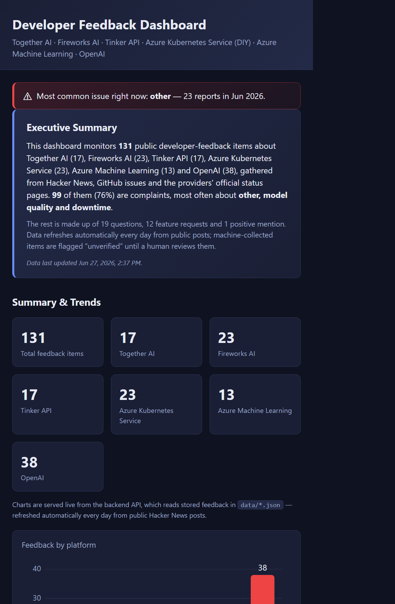

# Developer Feedback Dashboard

A **local** dashboard that visualizes public developer feedback — complaints, questions,
feature requests, and positive feedback — about **Together AI** and **Fireworks AI**.



> **MVP scope:** this app currently reads **only** the pre-collected JSON files in
> [data/](data/) (`data/*.json`). There are **no live API calls and no scraping yet** —
> the dataset is loaded from disk into memory at startup and served read-only. See
> [Roadmap](#roadmap--next-steps) for how real sources get wired in.

> **Status: Phase 1 MVP — feature-complete.** Local-only, **zero-dependency** Node server
> (built-in `http`, no Express) with a REST API, filters, search, summary charts (y-axis
> scale, gridlines, legends, value labels), tests, and docs. Real-source ingestion is
> intentionally deferred to a later phase.

For the full design rationale (schema mapping, `feedback_type` derivation rules, data
flow), see [ARCHITECTURE.md](ARCHITECTURE.md). For the catalog of public sources and the
data guardrails, see [SOURCES.md](SOURCES.md).

---

## Features

- **Summary & trends** — total items, per-platform counts, breakdown by feedback type and
  category, and a simple "trend by month" derived from item dates.
- **Charts** — three lightweight, dependency-free **inline SVG** charts in the trends
  section: feedback **by platform** (Together AI / Fireworks AI), feedback **by type**
  (Complaint / Question / Feature Request / Praise), and a **trend by month** line chart
  built from the `date` field. All charts are generated **entirely from the local
  `data/*.json`** (via `GET /api/summary`) — no live APIs, no scraping, no chart library.
- **Filters** — filter by **platform** (Together AI / Fireworks AI), **feedback type**,
  **category**, and a free-text **search** box (matches the summary and original text).
  Filters combine (AND) and re-query the API live.
- **Feedback cards** — one card per item showing the **platform**, **feedback type**,
  **source**, a short **summary**, the **original text** (when present), the **date**
  (when present), and a link to the **source URL**. A small "Verified" badge appears for
  verified items.

---

## Dashboard tour

The dashboard is a single page with three stacked sections. The screenshot above shows the
live app; the text layout below mirrors what renders at `http://localhost:3000/`.

```
┌──────────────────────────────────────────────────────────────────────┐
│  Developer Feedback Dashboard — Together AI & Fireworks AI            │  ← header
├──────────────────────────────────────────────────────────────────────┤
│  Summary & Trends                                                     │
│  “Charts are generated from local data/*.json only.”                  │
│  ┌─────────┐ ┌─────────┐ ┌─────────┐   ← stat cards (total + per-     │
│  │ Total 7 │ │ Together│ │Fireworks│      platform counts)            │
│  └─────────┘ └─────────┘ └─────────┘                                  │
│  ┌──────────────────────┐ ┌──────────────────────┐                    │
│  │ Feedback by platform │ │  Feedback by type    │  ← inline-SVG bar  │
│  │  ▆▆      ▂           │ │  ▆ ▁ ▂ ▁             │     charts w/ value │
│  │  legend: ■ … ■ …     │ │  legend: ■ … ■ …     │     labels+legends  │
│  └──────────────────────┘ └──────────────────────┘                    │
│  ┌──────────────────────────────────────────────────┐                 │
│  │ Trend by month  ●─●─●──●     ← line+area chart    │                 │
│  │ legend: ● Feedback items per month  7             │                 │
│  └──────────────────────────────────────────────────┘                 │
│  By category: latency ▆▆▆ · pricing ▆▆ · docs ▆ · other ▆             │
├──────────────────────────────────────────────────────────────────────┤
│  Filters:  [Platform ▾] [Type ▾] [Category ▾] [Search…] [Reset]       │
├──────────────────────────────────────────────────────────────────────┤
│  Feedback  (N items)                                                  │
│  ┌───────────────┐ ┌───────────────┐ ┌───────────────┐               │
│  │ provider  type│ │ provider  type│ │ provider  type│  ← feedback    │
│  │ summary…      │ │ summary…      │ │ summary…      │     cards       │
│  │ src · date ↗  │ │ src · date ↗  │ │ src · date ↗  │               │
│  └───────────────┘ └───────────────┘ └───────────────┘               │
└──────────────────────────────────────────────────────────────────────┘
```

**1. Summary & Trends** — stat cards plus three **inline-SVG charts** (no chart library):
*Feedback by platform*, *Feedback by type* (with `positive` shown as **Praise**), and a
*Trend by month* line chart built from the `date` field. Every bar/point shows its **count
as a label**, charts have a minimal **y-axis scale with light gridlines**, and each chart
has a **color-swatch legend** (swatch · label · count), so counts are readable without
hovering. A "By category" bar list rounds out the section.

**2. Filters** — platform, feedback type, category, and a free-text search box; selections
combine (AND) and re-query `/api/feedback` live.

**3. Feedback** — responsive card grid; one card per item with the platform, color-coded
feedback-type badge, source, summary, original text/date/source link when present, and a
verified badge.

> All three sections are driven entirely by `GET /api/summary` and `GET /api/feedback`,
> which are computed **only** from the local `data/*.json` files — no live APIs, no scraping.

---

## Tech stack

| Layer | Choice |
| --- | --- |
| Backend | **Zero-dependency Node.js** — the built-in `http` module reads `data/*.json`, normalizes in memory, and exposes a small REST API. **No Express, no framework.** |
| Data store | **In-memory array**, built once at startup from the JSON files. No database. |
| Frontend | **Static HTML + CSS + vanilla JS** — no framework, no build step. Served by the same Node server. |
| Tests | **Node's built-in `node:test`** (`node --test`). No extra test dependency. |

The app has **zero runtime dependencies** — everything uses the Node standard library and
the browser platform, so there is nothing to `npm install`. Full detail in
[ARCHITECTURE.md](ARCHITECTURE.md).

---

## Project structure

```
.
├── ARCHITECTURE.md                 # design: schema, feedback_type rules, data flow
├── SOURCES.md                      # public source catalog + data guardrails
├── package.json                    # no deps; "start" + "test" scripts
├── backend/
│   ├── server.js                   # Node http server: static hosting + /api routes
│   ├── loader.js                   # reads data/*.json from disk -> raw records
│   ├── normalizer.js               # raw record -> normalized schema (+ feedback_type)
│   └── store.js                    # in-memory store: load(), all(), filter(), summary()
├── frontend/                       # static, served at "/"
│   ├── index.html                  # dashboard markup
│   ├── styles.css                  # layout + cards + charts + legends
│   └── app.js                      # fetch /api/*, render charts + filters + cards
├── data/                           # ONLY data source for the MVP
│   ├── together-ai-complaints.json
│   ├── fireworks-ai-complaints.json
│   ├── *.md                        # human-readable reports / weekly summary
│   └── summary.json
└── tests/
    ├── normalizer.test.js          # mapping + feedback_type rules
    └── api.test.js                 # endpoint filters + summary counts
```

---

## Prerequisites

- **Node.js** (any recent LTS). `npm` is **not** required — the app has no dependencies to
  install.

No other tooling is required — there is no build/bundle step.

---

## How to run locally

The app has **zero dependencies**, so there is nothing to install — just start it:

```powershell
# Start the server (loads data/*.json into memory)
node backend/server.js

# Then open the dashboard
#   http://localhost:3000/
```

If you have `npm`, the script wrappers also work (they just call `node`):

```powershell
npm start      # = node backend/server.js
npm test       # = node --test
```

- The server listens on port **3000** by default. Override it with the `PORT`
  environment variable (PowerShell: `$env:PORT=8080; node backend/server.js`).
- The frontend is served from the same origin, so the browser calls `/api/*` directly.

Run the tests:

```powershell
node --test     # runs the suite over tests/ (npm test also works)
```

---

## API reference

Base URL: `http://localhost:3000`. All responses are `application/json`. Filtering is
case-insensitive; invalid enum values return `400`.

| Method | Path | Purpose |
| --- | --- | --- |
| `GET` | `/api/health` | Liveness + item count + loaded source files. |
| `GET` | `/api/feedback` | List normalized feedback items, with optional filters. |
| `GET` | `/api/summary` | Aggregate counts + month trend. Optional `platform` scope. |

### `GET /api/feedback`

Query params (all optional, combinable):

| Param | Type | Effect |
| --- | --- | --- |
| `platform` | string | match `provider_slug` or `provider` (e.g. `together-ai`, `fireworks-ai`) |
| `feedback_type` | enum | `complaint` \| `question` \| `feature_request` \| `positive` |
| `category` | enum | one of the category values (see [Data format](#data-format)) |
| `q` | string | substring match (case-insensitive) over `summary` + `original_text` |

**Example request:**

```
GET /api/feedback?platform=together-ai&feedback_type=complaint&q=latency
```

**Example response (truncated):**

```json
{
  "count": 1,
  "filters_applied": {
    "platform": "together-ai",
    "feedback_type": "complaint",
    "category": null,
    "q": "latency"
  },
  "items": [
    {
      "id": "tg-0002",
      "provider": "Together AI",
      "provider_slug": "together-ai",
      "feedback_type": "complaint",
      "category": "latency",
      "sentiment": "negative",
      "summary": "In a user's informal latency benchmark, Together AI was the slowest...",
      "original_text": "Time taken for get_together_ai_response_requests: 2.60 seconds ...",
      "source": "hackernews",
      "source_url": "https://news.ycombinator.com/item?id=40129707",
      "corroborating_urls": [],
      "author_handle": "rkwasny",
      "date": "2024-04-23",
      "verified": false
    }
  ]
}
```

### `GET /api/summary`

Returns `total`, `by_platform`, `by_feedback_type` (all type keys always present, even at
0), `by_category`, `trend_by_month` (ascending `YYYY-MM` buckets), and `undated_count`.

### `GET /api/health`

```json
{ "status": "ok", "items_loaded": 7, "sources": ["together-ai-complaints.json", "fireworks-ai-complaints.json"] }
```

---

## Data format

### Input schema — `data/*.json` (what the loader consumes)

Each file is a single object with a top-level header plus a `complaints[]` array:

```jsonc
{
  "provider": "Together AI",        // platform name (becomes provider / provider_slug)
  "generated_at": "2026-06-24T00:00:00Z",
  "window": "last 365 days (plus a few older notable items)",
  "source_count": 6,
  "note": "Sample run. Source = Hacker News (Algolia) ...",
  "complaints": [
    {
      "id": "tg-0002",                 // string, unique per item
      "complaint": "In a user's ...",  // short summary
      "quote": "Time taken for ...",   // original text (empty -> null)
      "category": "latency",           // enum (see below)
      "sentiment": "negative",         // enum (see below)
      "author_handle": "rkwasny",      // public handle only, or null
      "source": "hackernews",          // source platform label
      "source_url": "https://news.ycombinator.com/item?id=40129707",
      "corroborating_urls": [],        // string[]; may be empty
      "date": "2024-04-23",            // YYYY-MM-DD, or null
      "verified": false                // boolean
    }
  ]
}
```

### Output schema — normalized API items (what `/api/feedback` returns)

The normalizer maps each raw complaint 1:1 and **derives `feedback_type`**:

```jsonc
{
  "id": "tg-0002",
  "provider": "Together AI",          // from file top-level "provider"
  "provider_slug": "together-ai",     // derived slug
  "feedback_type": "complaint",       // DERIVED (see ARCHITECTURE.md §3.1)
  "category": "latency",              // passthrough
  "sentiment": "negative",            // passthrough
  "summary": "...",                   // from "complaint"
  "original_text": "...",             // from "quote" (empty/whitespace -> null)
  "source": "hackernews",
  "source_url": "https://...",        // empty -> null
  "corroborating_urls": [],
  "author_handle": "rkwasny",         // empty -> null
  "date": "2024-04-23",               // must match YYYY-MM-DD, else null
  "verified": false
}
```

### Allowed enum values

| Field | Allowed values |
| --- | --- |
| `feedback_type` *(output, derived)* | `complaint`, `question`, `feature_request`, `positive` |
| `category` | `latency`, `downtime`, `billing`, `rate_limits`, `model_quality`, `api_change`, `support`, `docs`, `pricing`, `other` |
| `sentiment` | `negative`, `neutral`, `mixed` |

The `feedback_type` derivation is deterministic (first matching rule wins) and is the
single source of truth in [backend/normalizer.js](backend/normalizer.js); the exact rule
table is documented in [ARCHITECTURE.md](ARCHITECTURE.md) §3.1.

---

## How the complaint skills plug into the pipeline (future)

The two workspace skills in `.github/skills/` —
`together-ai-complaints` and `fireworks-ai-complaints` — are the **data-collection /
refresh** stage of this same pipeline, deliberately decoupled from the app.

- Each skill gathers public developer feedback from the approved sources in
  [SOURCES.md](SOURCES.md) (Hacker News, GitHub, Reddit, status pages, etc.), applies the
  guardrails, deduplicates incidents, categorizes them, and **writes the same-shaped
  JSON** back to `data/together-ai-complaints.json` and `data/fireworks-ai-complaints.json`.
- Because [backend/loader.js](backend/loader.js) reads whatever is on disk in `data/`, the
  loader **auto-consumes** refreshed files on the next startup — **no application code
  change is needed**. Running a skill = refreshing the dataset.
- Pipeline view:
  `Skill (refresh) → data/*.json → loader → normalizer → store → API → UI`.
- To pick up new data today: re-run the skill, then restart the server. (A future
  enhancement could add a file-watch or a reload endpoint.)

The contract holds as long as skills keep emitting the documented raw item fields
(`id, complaint, quote, category, sentiment, author_handle, source, source_url,
corroborating_urls, date, verified`).

---

## Guardrails

These rules (defined in [SOURCES.md](SOURCES.md)) govern every item, current and future:

- **Public sources only** — no private, paywalled, or authenticated-only content.
- **Cite every claim** — every record must carry a working `source_url`; no source = not
  included.
- **User-reported phrasing** — items are presented as user-reported experiences, never as
  stated fact.
- **No PII** — only a public author handle may be stored; no names, emails, or other
  personal data.
- **Verified flag** — `verified: true` only when corroborated by an official status page
  or multiple independent sources; otherwise `false`.

> **Note on the current sample data:** all items are `verified: false` sample records
> sourced from Hacker News (Algolia) public search. The `note` field flags known **bias** —
> several critical Together AI items were posted by competitors launching rival inference
> products. Reddit was excluded from the sample because its public `search.json` returned
> HTTP 403 to the automated request.

---

## Roadmap / next steps

1. **Wire real sources** — start with Hacker News (already proven, no auth), then GitHub
   issues/discussions (token), then Reddit via the official OAuth API (public
   `search.json` is 403-blocked). Status pages for `verified: true` corroboration.
2. **Persistence** — move beyond in-memory load (file-watch / reload endpoint, or a
   lightweight store) so refreshed data is picked up without a manual restart.
3. **Charts** — ✅ basic inline-SVG charts (by platform, by type, trend by month) are in
   the trends section, generated from local JSON only. Future: richer visuals (stacked
   per-platform trend, interactive tooltips/legends).

See [SOURCES.md](SOURCES.md) for the full source catalog, access methods, and rate limits.
