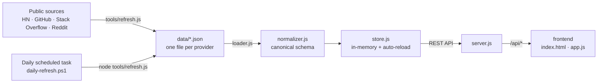

# Developer Feedback Dashboard — Workflow Guide

_A single reference for how the whole project works: how data flows, how it stays fresh,
how to run and extend it, and how the build squad produced it._

---

## 0. Summary (the whole workflow in one minute)

1. **Collect** — public developer feedback about each provider (Together AI, Fireworks AI,
   Tinker API, Azure Kubernetes Service, Azure Machine Learning, Azure AI Foundry, OpenAI)
   is gathered from public sources (Hacker News, GitHub issues, Stack Overflow, Reddit) and
   written to one JSON file per provider in [`data/`](../data/).
2. **Normalize** — the backend reads those files and maps every item to one canonical
   schema, deriving a `feedback_type` and `provider_slug`.
3. **Store** — the normalized items live in a tiny in-memory store built at startup (and
   reloaded automatically when the data files change).
4. **Serve** — a zero-dependency Node `http` server exposes a small REST API and hosts the
   static frontend.
5. **Display** — the browser dashboard fetches the API and renders stat cards, charts,
   filters, search, a comparison view, and CSV/JSON export.
6. **Refresh** — a daily Windows scheduled task re-runs the collector, de-duplicates, and
   appends new items, so the dashboard keeps itself current with no manual work.



---

## 1. Data pipeline — collect → normalize → store → serve

### 1.1 Collect
- Each provider has one JSON file in [`data/`](../data/), e.g.
  [`together-ai-complaints.json`](../data/together-ai-complaints.json).
- A file has **top-level metadata** (`provider`, `generated_at`, `window`, `source_count`,
  `note`) and a **`complaints` array**.
- Each item carries: `id`, `complaint`, `quote`, `category`, `sentiment`, `author_handle`,
  `source`, `source_url`, `corroborating_urls`, `date`, `verified` (and `auto_collected`
  for machine-gathered items).

### 1.2 Load
- [`backend/loader.js`](../backend/loader.js) reads the fixed list of `SOURCE_FILES` from
  `data/`, tags each complaint with its file's top-level `provider`, and returns a flat
  `{ provider, raw }[]`. Missing files are skipped (so test fixtures work).

### 1.3 Normalize
- [`backend/normalizer.js`](../backend/normalizer.js) maps each raw item 1:1 to the
  **canonical schema** the API returns:
  - `id`, `provider`, `provider_slug` (derived slug), `feedback_type` (**derived**),
    `category`, `sentiment`, `summary` (from `complaint`), `original_text` (from `quote`),
    `source`, `source_url`, `corroborating_urls`, `date`, `verified`.
- **`feedback_type` derivation** (first match wins): `question` → `feature_request` →
  `complaint` → `positive` → `neutral` → fallback `complaint`, based on keyword cues in the
  summary/quote plus the `category` and `sentiment`.

### 1.4 Store
- [`backend/store.js`](../backend/store.js) builds an **in-memory array** once at startup
  via `load()`, and exposes `all()`, `filter(query)`, and `summary(query)`.
- It tracks the newest file modification time and **auto-reloads** when any `data/*.json`
  changes — so a refresh shows up live without restarting the server.

### 1.5 Serve
- [`backend/server.js`](../backend/server.js) is a **zero-dependency** Node `http` server. It
  hosts the static frontend at `/` and exposes the REST API:

| Endpoint | Returns |
|----------|---------|
| `GET /api/health` | Status + the list of source files loaded |
| `GET /api/summary` | Totals, per-provider/category/type counts, trends, top issue |
| `GET /api/feedback` | The normalized feedback items (honors filter query params) |
| `GET /api/feedback.csv` | The same items as CSV (for Excel) |

---

## 2. Automation — how it stays fresh

- **Collector:** [`tools/refresh.js`](../tools/refresh.js) pulls recent public mentions of
  each provider from **Hacker News** (Algolia API), **GitHub** (public issue search),
  **Stack Overflow** (Stack Exchange API), and **Reddit** (only if free OAuth creds are
  present). It keeps negative-leaning items, maps them to the raw schema, **de-duplicates**
  against what's already stored, and appends only genuinely new items.
  - Window: **last 365 days**; safety cap **25 new items per provider per run**.
  - Auto-collected items are flagged `auto_collected: true` and always `verified: false`.
  - Hand-curated items are **never modified or removed**.
- **Daily task:** [`tools/daily-refresh.ps1`](../tools/daily-refresh.ps1) runs the collector
  with Node from the project root and logs to
  `%LOCALAPPDATA%\DevFeedbackDashboard\daily-refresh.log`. It is launched each morning by a
  Windows scheduled task (`DevFeedbackDashboard-DailyRefresh`).
- **Auto-start:** a second scheduled task (`DevFeedbackDashboard-StartServer`) launches the
  server at login so `http://localhost:3000` is always available.
- Updating `data/*.json` advances the dashboard's "Data last updated" timestamp and the
  store reloads automatically — **no restart required**.

---

## 3. Developer workflow — run, test, extend

### 3.1 Run
```powershell
node backend/server.js      # or: npm start
```
Then open `http://localhost:3000`.

### 3.2 Test
```powershell
npm test                    # node --test
```
Covered by [`tests/`](../tests/): `normalizer.test.js` (mapping + `feedback_type` rules),
`api.test.js` (store filters + summary counts), `http.test.js` (live endpoint contract,
including 400s). Test fixtures live in `tests/fixtures/data/`.

### 3.3 Add a new provider
1. Create `data/<provider>-complaints.json` with the top-level metadata + `complaints`
   array (match the schema in §1.1).
2. Register the filename in `SOURCE_FILES` in
   [`backend/loader.js`](../backend/loader.js).
3. If it should auto-refresh, add a provider entry (queries, GitHub queries, name cues,
   id prefix) to the `PROVIDERS` list in [`tools/refresh.js`](../tools/refresh.js).
4. Restart (or let the store auto-reload) and verify it appears in the dashboard.

### 3.4 Add a new source
Extend the fetchers in [`tools/refresh.js`](../tools/refresh.js) and add a label to
`SOURCE_LABELS`. Keep collection precise (match on the provider's own domains/identifiers)
and flag results `auto_collected: true`, `verified: false`.

---

## 4. Architecture overview

| Layer | Choice | Why |
|-------|--------|-----|
| Backend | Zero-dependency Node.js (built-in `http`) | Smallest viable server; nothing to `npm install` |
| Data store | In-memory array, rebuilt at startup | Dataset is tiny; a DB would be over-engineering |
| Frontend | Static HTML + CSS + vanilla JS (no build) | Read-only list + filters + charts; `fetch()` is enough |
| Tests | Node's built-in `node:test` + `assert` | Zero extra test dependency |

**Guiding principle:** the simplest thing that works — no runtime dependencies, no build
step, no database. Normalization lives server-side so the API contract is identical whether
there are 2 items or 2,000, keeping the frontend "dumb."

See [`ARCHITECTURE.md`](../ARCHITECTURE.md) for the full folder structure and schema detail.

---

## 5. Squad / agent workflow — how the project was built

The project was produced by the **Developer Feedback Monitoring Squad**, an orchestrator
that assigns work to specialist subagents and integrates their outputs:

| Agent | Responsibility | Output |
|-------|----------------|--------|
| **Squad Architect** | System design, folder structure, tech stack, API contract | `ARCHITECTURE.md` |
| **Squad Research** | Identify public feedback sources, APIs, rate limits, ToS | `SOURCES.md` |
| **Squad Backend** | API server, source fetchers, normalizer, data store | `backend/`, `tools/` |
| **Squad Frontend** | Dashboard UI: filters, search, charts, export | `frontend/` |
| **Squad Summarization** | Categorize feedback, detect trends, weekly summaries | summary JSON/MD |
| **Squad Testing** | Verify APIs and UI; edge cases (empty, malformed, rate-limited) | `tests/` |
| **Squad Scribe** | README, architecture docs, decision log | docs |

Typical flow: **Architect** defines the contract → **Research** documents sources →
**Backend** implements collection/normalization/API → **Frontend** builds the dashboard →
**Summarization** adds trends/summaries → **Testing** validates → **Scribe** documents.

---

## 6. Data honesty & quality safeguards

- **Hand-curated** items are written and source-cited by hand (`verified: true` where a
  status page or direct source confirms it).
- **Auto-collected** items carry an "⚙ Auto · unverified" badge, use keyword-based
  category/sentiment, and are coarser than curated items.
- Every item links to its **real public source** (`source_url`) — no unsourced claims.
- A bot/telemetry filter drops machine-generated CI posts so only human feedback is kept.
- Blocked/paid sources (Reddit without OAuth, Trustpilot, G2, X) are documented but not
  scraped.
